# PackGuard

> Local, multi-repo, multi-ecosystem package version governance with a native offset
> policy engine and supply-chain intelligence (CVE / malware / typosquat). One Rust
> binary, four modes, no cloud.

PackGuard scans your dependency manifests, queries the package registry (npm, PyPI),
classifies how far each dep has drifted from `latest`, checks that drift against a
per-repo policy (`.packguard.yml`), pulls advisory data from OSV + GitHub Advisory +
optional scanners, and stores the result in a local SQLite cache so you can report
on it offline.

See [CONTEXT.md](./CONTEXT.md) for the full vision, architecture, and roadmap.

**Phase status — delivered:**

- ✅ **Phase 0 / 1 / 1.5** — MVP CLI: npm + PyPI, SQLite store, policy engine
  (offset / pin / stability / min_age_days), `init`, `scan`, `report` (table /
  JSON / SARIF), strict resolver with version history.
- ✅ **Phase 2** — Vuln intel: OSV dump + GHSA git ingest, dialect-aware matcher,
  `block.cve_severity`, OSV API live fallback, `audit` command.
- ✅ **Phase 2.5** — Malware & typosquat: OSV-MAL harvest, top-N typosquat
  heuristic, optional Socket.dev scanner, `block.malware`, `block.typosquat`,
  `audit --focus`, unified `Risk` column in `report`.
- ✅ **Phase 4** — Local dashboard: `packguard-server` (axum + ts-rs),
  React 19 + Vite SPA, Overview / Packages / Package detail with visx
  timeline / Policies YAML editor with dry-run preview, served by a single
  `packguard ui` binary that embeds the Vite bundle in release.
- ✅ **Phase 5** — Dependency graph + contamination: transitive edges
  harvested from `package-lock.json` / `pnpm-lock` (v6/v7 + v9 snapshots)
  / `poetry.lock` / `uv.lock`, Cytoscape `/graph` page with focus-CVE
  mode that traces a chain from a workspace root to the vulnerable
  package, Compatibility tab on the package detail, and a
  `packguard graph` CLI (ascii / dot / json).
- ✅ **Phase 7** — Per-project scoping (monorepo-ready): `GET
  /api/workspaces` + `?project=<path>` query param on every list-returning
  endpoint, strict backend validation (404 with known-workspace list on
  a miss), `<WorkspaceSelector />` header dropdown that writes the scope
  into the URL and persists the last pick in localStorage, per-page
  scope badge, per-workspace `.packguard.yml` editor, and "Used by ·
  N workspaces" drill-down on the Compatibility tab. CLI `report` /
  `audit` / `graph` accept `--project <path>` as a flag alias of the
  existing positional; all commands fall back to the most-recent scan
  with an explicit stderr banner on an empty argv.
- ✅ **Phase 8a** — Release-ready packaging: multi-stage Dockerfile
  (~46 MB distroless image with ui-embed), GitHub Actions CI +
  `release.yml` workflow producing 5 platform binaries + SHA256SUMS +
  optional cosign signatures + multi-arch `ghcr.io` push + Trivy scan,
  POSIX `install.sh` one-liner with zero-trust SHA256 verification, four
  copy-paste CI/IDE recipes under [`docs/integrations/`](docs/integrations/README.md)
  (GitLab CI, GitHub Actions, pre-commit, VSCode), `packguard init
  --with-ci <gitlab|github|jenkins>` generating ready-to-paste pipeline
  snippets, Homebrew formula template, and a full [`PUBLISHING.md`](PUBLISHING.md)
  runbook for the credential-bound Phase 8b steps.

---

## Dashboard

```bash
# Dev: run the server + Vite side-by-side (hot reload on the UI).
packguard ui           # starts the API on :5174
pnpm --dir dashboard dev   # starts Vite on :5173 (auto-proxies /api/*)

# Release: single binary, no node runtime needed.
PACKGUARD_SKIP_UI_BUILD=1 cargo build --release -p packguard-cli --features ui-embed
./target/release/packguard ui
```

The release binary serves the dashboard, the REST API, and auto-opens the
browser. `--no-open` suppresses the auto-open, `--port` / `--host` override
the bind. `PACKGUARD_SKIP_UI_BUILD=1` skips the automatic `pnpm build` in
`build.rs` when you've pre-built the dashboard (CI). The `ui-embed` feature
is opt-in so debug builds stay fast and don't require pnpm on the PATH.

### Pages

| Page | URL | Highlights |
|------|-----|------------|
| Overview | `/` | Health score · packages tracked · CVE/supply-chain donuts · top-5 risks |
| Packages | `/packages` | Filterable + sortable table, URL-state filters, paginated |
| Package detail | `/packages/:eco/:name` | 6-tab view: Versions + visx timeline, Vulnerabilities, Malware, Policy eval, Compatibility (Used by · per-workspace drill-down), Changelog |
| Graph | `/graph` | Cytoscape (dagre + cose-bilkent), URL-driven filters, focus-CVE contamination mode |
| Policies | `/policies` | CodeMirror YAML editor per-workspace, dry-run preview vs current policy, atomic save |

Every list-returning page reads the active workspace from `?project=<path>`
and threads it into the backend call. The header `Workspace` selector
writes that param without unmounting the current route — safe to bookmark,
safe to flip mid-session, safe to open two browser tabs on different
workspaces side by side. The scope badge top-right of each page tells
you at a glance whether the numbers are aggregated or scoped.

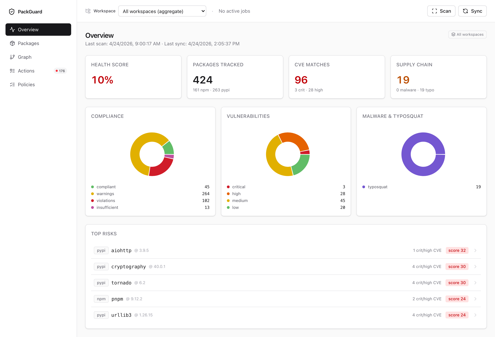
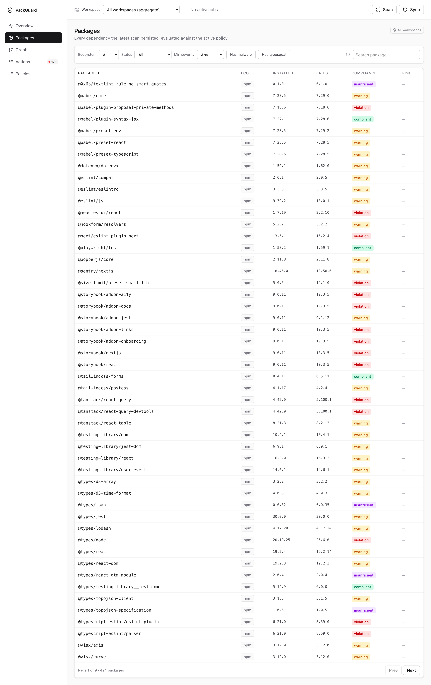
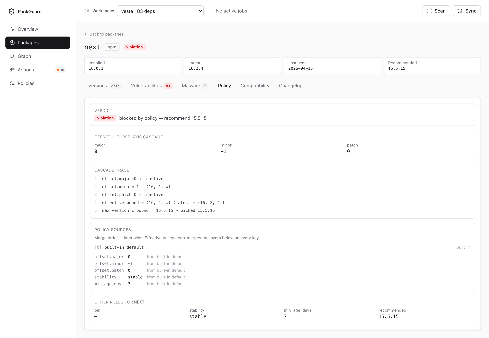
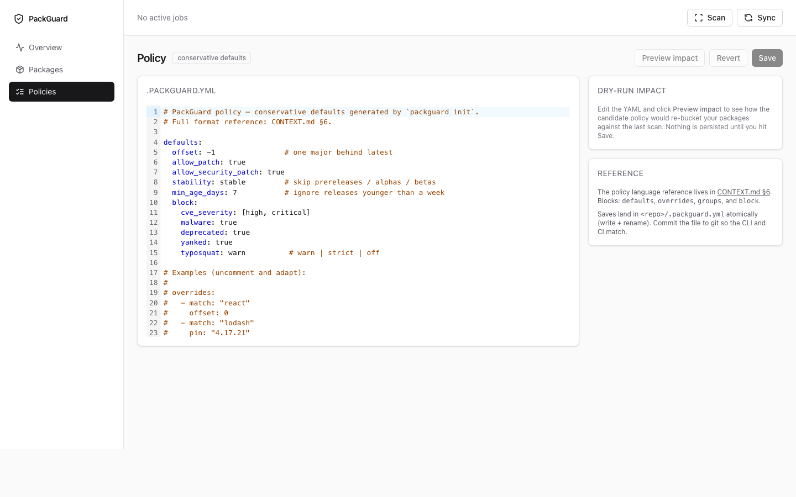
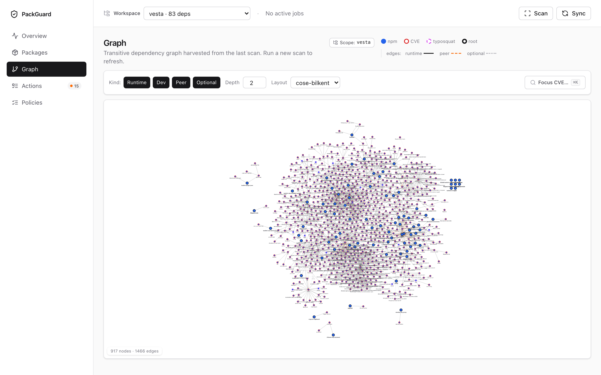
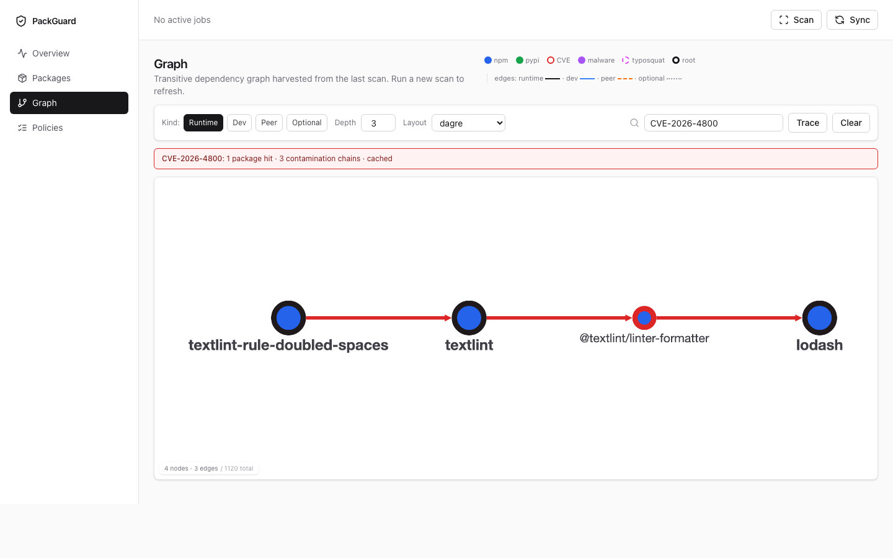
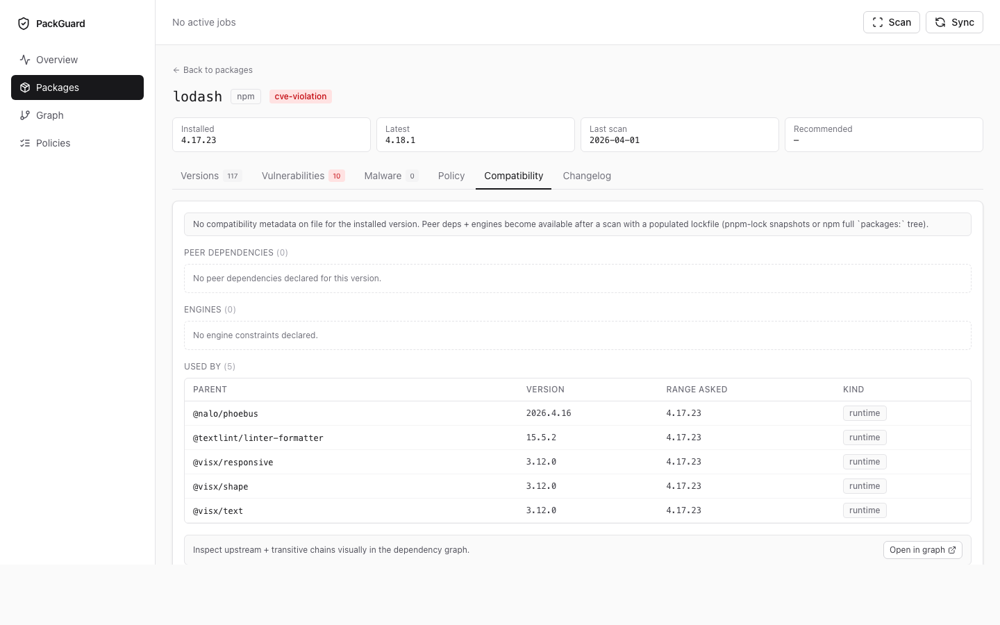

**Phase 7 — Workspace scoping (two browser tabs, two workspaces, same store):**

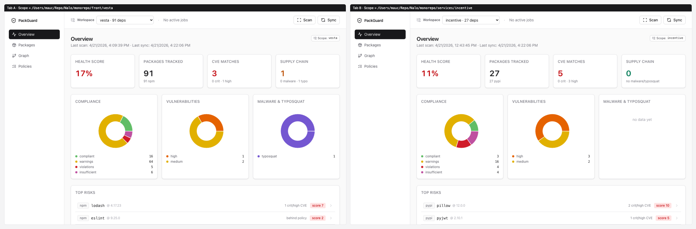
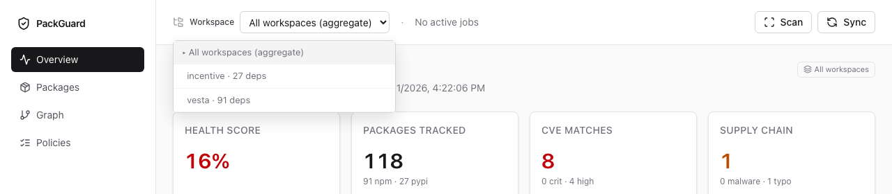
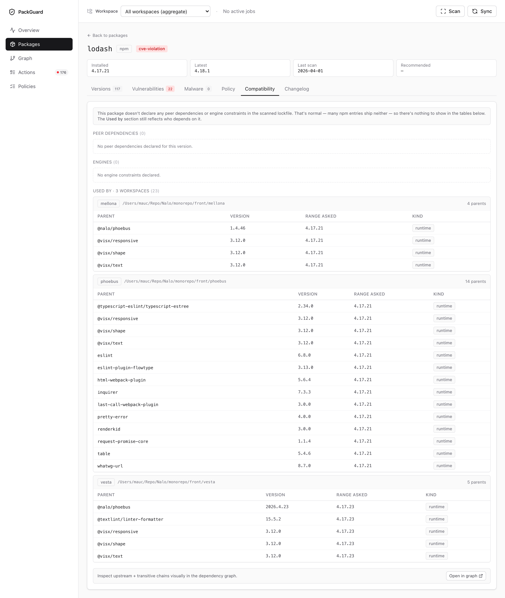
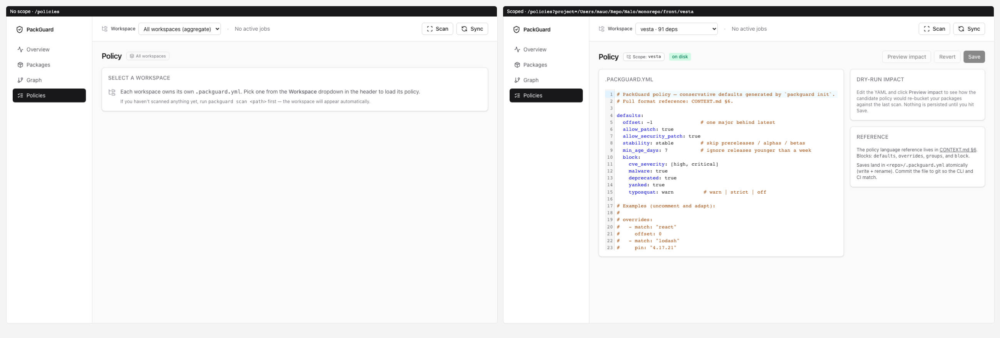

### Graph CLI

```bash
# Read-only tree view of the last scan (ascii by default).
packguard graph path/to/repo

# Just the subtree rooted at a specific package.
packguard graph path/to/repo --focus npm:react@18.3.1

# All contamination chains for a CVE — same BFS + cache as the dashboard.
packguard graph path/to/repo --contaminated-by CVE-2026-4800

# Pipe into Graphviz.
packguard graph path/to/repo --format dot | dot -Tsvg -o deps.svg

# Machine-readable (same DTOs ts-rs exports for the dashboard).
packguard graph path/to/repo --format json
```

---

## Install

Pick the channel that fits your machine. Every option installs the
same `packguard` binary — the scanner, the dashboard, and the CLI all
ship together.

```bash
# Option 1 — curl | sh (verifies SHA256, no sudo if /usr/local/bin isn't writable)
curl -fsSL https://raw.githubusercontent.com/Tmauc/packguard/main/install.sh | sh

# Option 2 — Docker (~46 MB, multi-arch)
docker run --rm -v "$PWD":/workspace ghcr.io/tmauc/packguard:latest scan /workspace

# Option 3 — Homebrew
brew tap Tmauc/packguard
brew install packguard

# Option 4 — from source (with the embedded dashboard)
cargo install --path crates/packguard-cli --features ui-embed
```

The binary is called `packguard`. Verify with `packguard --version`.

---

## Integrate in CI — 5-minute onboarding

Goal: a blocking pipeline gate on critical CVEs across any repo, in
three commits.

```bash
# 1. Generate the policy + a pipeline snippet pre-wired for your VCS.
packguard init --with-ci github          # or gitlab / jenkins
# ⇒ wrote .packguard.yml           (conservative defaults)
# ⇒ wrote .packguard/ci/github.yml (ready-to-paste snippet)
# ⇒ full recipe: docs/integrations/github-actions.md

# 2. Copy the snippet into the pipeline layout your repo expects.
mkdir -p .github/workflows && cp .packguard/ci/github.yml .github/workflows/packguard.yml

# 3. Commit + push.
git add .packguard.yml .github/workflows/packguard.yml \
  && git commit -m "ci: add PackGuard supply-chain gate" \
  && git push
```

On the next PR, the workflow:
- installs PackGuard (fast — `install.sh` or the ghcr.io image),
- caches `~/.packguard/` keyed by a hash of your lockfiles,
- runs `scan → sync → report --fail-on-violation`,
- uploads SARIF into the Security tab.

A PR that introduces a critical CVE turns the check red and blocks
merge (if branch protection requires the check). That's it. Adjust
the YAML shape of `.packguard.yml` to tune the bar.

Full recipes + extras (monorepo matrix, scheduled intel refresh,
per-workspace scoping, pre-commit hook, VSCode tasks) live under
[`docs/integrations/`](docs/integrations/README.md).

---

## Quick start (local scan, no CI)

```bash
# 1. Write a conservative .packguard.yml in the repo.
packguard init

# 2. Scan — fetches registry data, classifies, and writes the store.
packguard scan

# 3. Refresh the supply-chain intel (OSV + GHSA dumps + typosquat lists).
packguard sync

# 4. Audit — list every CVE, malware finding, and typosquat suspicion.
packguard audit

# 5. Report — group by ecosystem/workspace, show policy compliance.
packguard report

# 6. Dashboard — interactive view of everything above.
packguard ui
```

By default the store lives at `~/.packguard/store.db`. Override with the global
`--store <path>` flag.

---

## Commands

### `packguard init [path] [--force]`

Detects supported ecosystems under `path` and writes
`<path>/.packguard.yml` with the conservative defaults template (`offset: -1`,
`stability: stable`, `min_age_days: 7`, block high/critical CVEs + malware +
deprecated + yanked, typosquat = warn). Refuses to overwrite unless `--force`.

### `packguard scan [path] [--offline] [--force]`

Walks the Tier 1 ecosystems (npm, PyPI), parses manifests + lockfiles, queries
the registry for the full version history, and persists everything to SQLite.
A SHA-256 fingerprint of (manifest + lockfiles) gates the registry round-trip;
re-runs that match the cached fingerprint short-circuit. `--offline` errors
cleanly when the cache was never populated.

### `packguard sync [--skip-osv] [--skip-ghsa] [--ghsa-cache <path>] [--all]`

Refreshes vulnerability and supply-chain intel:

- **OSV dumps** for npm and PyPI (`https://osv-vulnerabilities.storage.googleapis.com/{eco}/all.zip`),
  conditional GET via `If-None-Match` / `If-Modified-Since`. Dump entries with
  `MAL-*` ids or `database_specific.severity = malicious` are routed to the
  `malware_reports` table; everything else lands in `vulnerabilities`.
- **GitHub Advisory Database** via `git clone --depth 1` then `git pull
  --ff-only` of `github/advisory-database`. Only `advisories/github-reviewed/`
  is parsed.
- **Typosquat top-N reference list** for PyPI (hugovk's well-maintained
  `top-pypi-packages` JSON), 7-day TTL, cached at
  `~/.packguard/cache/reference/pypi-top-packages.json`. The npm baseline is
  embedded in the binary (~200 names); drop your own list at the same path
  to extend it.
- After the lists are loaded, every watched package is scored — suspects
  (Levenshtein ≤ 2, character swaps, prefix/suffix patterns) are persisted as
  `malware_reports` with `source = typosquat-heuristic`.

By default only advisories touching packages already in the store are persisted
(keeps the DB tight at ~hundreds of rows instead of hundreds of thousands).
`--all` persists every advisory in the dump (CI warm-up; balloons the DB).

### `packguard audit [path] [--focus] [--fail-on] [--fail-on-malware] [--severity] [--no-live-fallback]`

Reads the store (no network unless the live fallback fires) and prints every
matched risk for each installed dependency, in three sections:

- **CVE** — table with package, installed, advisory id (CVE preferred), severity,
  affected range, fix version. Rows survive `--severity` and `--fail-on`.
- **Malware** — table with package, installed, source (`osv-mal`, `ghsa-malware`,
  `socket.dev`), advisory ref, evidence summary. `--fail-on-malware` exits 1.
- **Typosquat suspects** — package, the legitimate name it resembles, edit
  distance, score (0.0–1.0), reason (swap / edit / prefix / suffix).

`--focus cve|malware|typosquat|all` (default `all`) restricts the output to a
single section. `--format table|json|sarif`. SARIF emits both CVE and malware
findings under `packguard.cve` and `packguard.malware` rules — drop the file
into GitHub's code-scanning UI for inline annotations.

When the `PACKGUARD_SOCKET_TOKEN` env var is set and `--no-live-fallback` is not
passed, every installed (eco, name, version) tuple is also queried against
[Socket.dev](https://socket.dev). Alerts that mention malware/backdoor get the
`Malware` kind; everything else (`installScripts`, `obfuscatedFile`, …) lands as
informational `ScannerSignal`. Token-less runs skip Socket silently. Without
`--no-live-fallback`, packages with no cached OSV advisory also trigger a
`POST /v1/query` against `api.osv.dev` (24h TTL per package).

### `packguard report [path] [--format table|json|sarif] [--fail-on-violation]`

Reads **only** the SQLite store (zero network). Loads `.packguard.yml` (or the
built-in conservative defaults), evaluates every stored dependency, and prints
a compact compliance table grouped by ecosystem → workspace → package:

- `Policy` column with `compliant` / `warning` / `violation` / `cve-violation`
  / `malware` / `typosquat` / `insufficient`.
- `Risk` column with combined badges: `2🔴 · 1🟠 · 1🏴‍☠️ · ⚠` (CVE counts +
  malware confirmed + typosquat suspects).
- Footer summary: compliant / warnings / violations / insufficient, plus
  vulnerability counts and `Supply-chain: 🏴‍☠️ N malware confirmed · ⚠ M
  typosquat suspects` when non-zero.

`--fail-on-violation` exits `1` when at least one row sits at `violation`,
`cve-violation`, or `malware`. JSON / SARIF outputs additive over Phase 2.

### `packguard ui [path] [--port N] [--host H] [--no-open]`

Boots the local dashboard. In debug builds the Rust server only serves
`/api/*` — run `pnpm --dir dashboard dev` alongside it so Vite proxies the
API calls. In a release build compiled with `--features ui-embed`, the
binary also serves the built Vite bundle under `/`, so a single command is
enough. Ctrl+C triggers a graceful shutdown.

### `packguard graph [path] [--workspace …] [--focus pkg] [--contaminated-by CVE] [--format ascii|dot|json] [--max-depth N] [--kind runtime,dev,peer,optional]`

Reads only the SQLite store (populate with `scan` first). Emits the
transitive dependency graph in one of three formats:

- `ascii` (default) — indented tree with per-node risk suffixes
  (`(high CVE)`, `(malware)`, `(unresolved peer)`).
- `dot` — Graphviz `digraph` with ecosystem-coloured fills + red borders
  on CVE hits. Pipe into `dot -Tsvg` or similar.
- `json` — raw `GraphResponse` (or `ContaminationResult` when
  `--contaminated-by` is set); same DTOs the dashboard consumes via ts-rs.

`--focus ecosystem:name@version` narrows to the forward-reachable subtree.
`--contaminated-by <advisory>` runs the inverse contamination BFS from the
given CVE/GHSA/alias and prints every root → hit chain; reuses the same
cache the `/graph` page does.

### `packguard scans [--json]`

Lists every `(path, ecosystem)` the store knows about — useful when
`report` / `audit` / `graph` bail with "no cached scan" and you've
forgotten where the scan ran from. Same rows feed the "Available scans"
hint on those errors. `--json` for scripting.

---

## Policy format (`.packguard.yml`)

Full reference in CONTEXT.md §6. Short tour:

```yaml
defaults:
  offset: -1              # stay one major behind latest
  allow_patch: true
  allow_security_patch: true
  stability: stable       # exclude prereleases
  min_age_days: 7         # ignore releases younger than a week
  block:
    cve_severity: [high, critical]   # any installed match → cve-violation
    malware: true                    # MAL-* / GHSA malware on installed → malware
    deprecated: true
    yanked: true
    typosquat: warn                  # warn | strict | off (default warn)

overrides:
  - match: "react"          # exact name
    offset: 0
  - match: "lodash"
    pin: "4.17.21"          # hard pin
  - match: "@babel/*"       # glob
    offset: -2

groups:
  - name: security-critical
    match: ["jsonwebtoken", "bcrypt*", "@auth/*"]
    offset: 0
    min_age_days: 0
```

Resolution cascade: `defaults` → every matching `group` → every matching
`override`, later layers strictly overriding per-field.

---

## Supported ecosystems (Tier 1)

| Ecosystem | Managers          | Lockfile used for `installed`              |
|-----------|-------------------|--------------------------------------------|
| npm       | npm               | `package-lock.json` v2 or v3               |
| npm       | pnpm              | `pnpm-lock.yaml` (root importer)           |
| npm       | yarn              | manifest-only (yarn.lock parsing deferred) |
| PyPI      | poetry            | `poetry.lock`                              |
| PyPI      | uv                | `uv.lock`                                  |
| PyPI      | pip               | **Declared-only** (see below)              |

Tier 2 (Cargo, Go modules) lands post-MVP. Everything explicitly out of scope is
listed in CONTEXT.md §4.

### pip declared-only mode

pip doesn't ship a native lockfile format. PackGuard parses `requirements*.txt`
in best-effort PEP 508 and only treats a requirement as **installed** when it
uses an exact pin (`pkg==1.2.3`). Loose ranges like `flake8>=7.0` stay at
`installed = None` and classify as `Unknown` / `Warning`. The upshot: a
`requirements.txt`-only repo will produce a mix of fully-classified rows (for
`==` pins) and warnings (for everything else) — if you need full coverage, move
to `pyproject.toml` + `uv.lock` or run `pip-compile --generate-hashes`.

---

## Supply-chain intel sources

| Source             | Activation                       | What it adds                                 |
|--------------------|----------------------------------|----------------------------------------------|
| OSV.dev dumps      | always (via `packguard sync`)    | CVE + MAL records for npm + PyPI             |
| GitHub Advisory DB | always (clone via `sync`)        | dedup with OSV via aliases at match time     |
| OSV `/v1/query`    | default; opt-out `--no-live-fallback` | per-(name, version) fallback when cache is cold (24h TTL) |
| Typosquat heuristic| always (lists refresh every 7d)  | Levenshtein ≤ 2, swaps, prefix/suffix       |
| Socket.dev         | `PACKGUARD_SOCKET_TOKEN=…`       | per-version scanner alerts (malware, install scripts, …) |

### Socket.dev setup

1. Sign up at [socket.dev](https://socket.dev) (free tier covers casual use).
2. Generate an API token in the dashboard.
3. `export PACKGUARD_SOCKET_TOKEN="sk_…"`.
4. Run `packguard audit`. The CLI prints a one-line banner confirming the
   token was detected; results land in `malware_reports` with
   `source = "socket.dev"`. Without the token, Socket is skipped silently.

### Phylum

Phylum's API is project-oriented rather than per-package, so it doesn't slot
into the same pull-based pattern as OSV / Socket. **Deferred** to a future
phase that introduces project-level scanners; the existing `socket.dev`
opt-in pattern shows the shape that pattern will take.

### Typosquat tuning

The default heuristic is intentionally conservative — it surfaces suspects but
the *base rate of typosquats among installed packages is ~0%*. Expect mostly
false positives. Rules of thumb:

- Treat suspects as items for human review, not blockers — the default
  `block.typosquat: warn` reflects this.
- Add legitimate confusables to the in-source whitelist
  (`crates/packguard-intel/src/typosquat/mod.rs::WHITELIST`) when an FP
  shows up repeatedly.
- For high-trust environments, set `block.typosquat: strict` per-group via
  `.packguard.yml` overrides instead of globally.

---

## Project layout

```
.
├── CONTEXT.md                  # source of truth for scope & decisions
├── Cargo.toml                  # workspace manifest
├── crates/
│   ├── packguard-core          # Ecosystem trait, npm + pypi parsers, shared types
│   ├── packguard-policy        # YAML parser, rule resolution, evaluator
│   ├── packguard-store         # rusqlite + refinery persistence (V1..V5)
│   ├── packguard-intel         # OSV/GHSA fetchers, matcher, malware harvest,
│   │                           # typosquat heuristic, OSV/Socket clients
│   ├── packguard-server        # axum REST API + job runner + ts-rs DTOs
│   │                           # (+ rust-embed fallback under ui-embed feature)
│   └── packguard-cli           # binary (init / scan / sync / audit / report / ui / graph)
├── dashboard/                  # Vite + React 19 SPA consuming the REST API
├── docs/screenshots/           # embedded dashboard captures (real Nalo data)
├── fixtures/                   # npm-basic, pypi-poetry, pypi-uv, pypi-pip
└── rust-toolchain.toml
```

---

## Development

```bash
cargo test          # full workspace test suite
cargo clippy --all-targets -- -D warnings
cargo fmt --all -- --check
cargo test -p packguard-server --features ui-embed --test embed  # dashboard serving

# Dashboard (Vite workspace).
pnpm --dir dashboard lint
pnpm --dir dashboard typecheck
pnpm --dir dashboard test
```

Regenerate TypeScript types after a DTO change in `packguard-server`:

```bash
PACKGUARD_REGEN_TYPES=1 cargo test -p packguard-server --test types_drift
```

Live tests gated by `PACKGUARD_LIVE_TESTS=1` exercise real api.osv.dev queries.
Without the env var they no-op with an explanatory print.

```bash
PACKGUARD_LIVE_TESTS=1 cargo test --test live_osv
```

---

## Non-goals (v1)

- No SaaS/cloud backend.
- No desktop app (no Tauri, no Electron).
- No IDE extension.
- No OS package managers (`apt`, `brew`, `pip install` behaviour beyond
  declared deps), no Docker / Helm, no Nix.
- No scraping of supply-chain blogs as a primary source — only structured APIs.

See CONTEXT.md §4 for the complete hors-scope list and §12-§14 for the
phase-by-phase plan with what's explicitly deferred.
